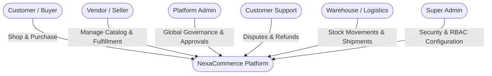
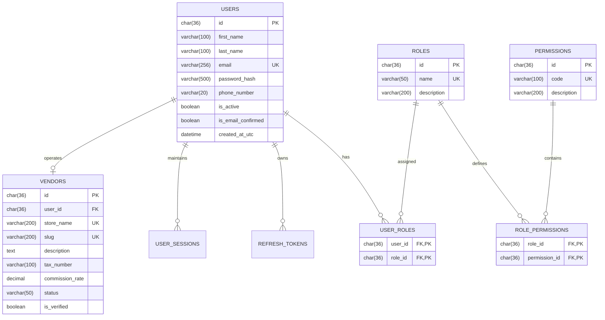
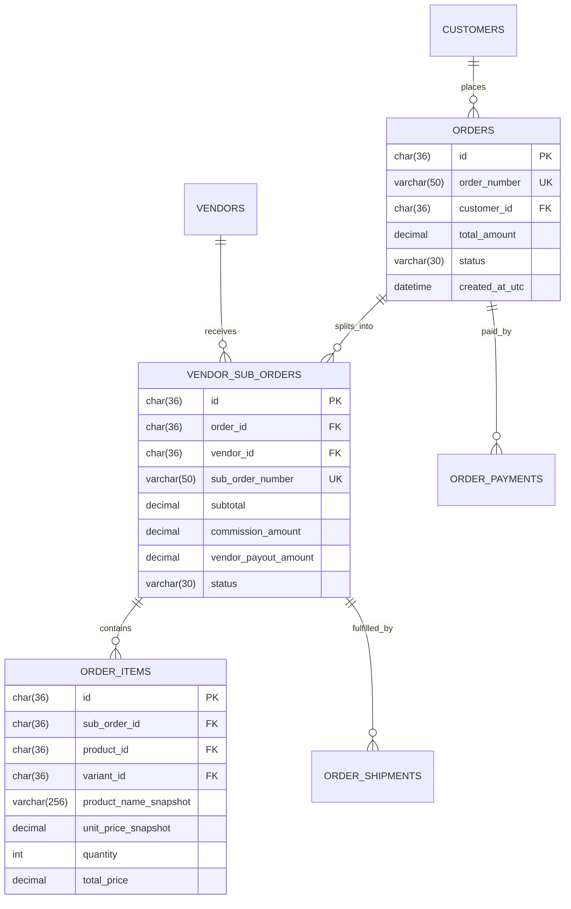
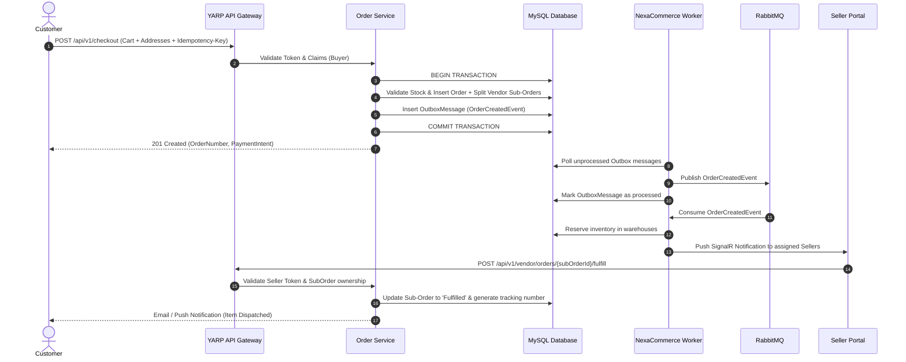

# NexaCommerce — Production-Level Distributed Commerce Platform
## Architecture & Implementation Blueprint (Multi-Role & Multi-Vendor Edition)

**Version:** 2.0 • **Date:** September 2026  
**Architecture:** Database-First Modular Monolith (Transitioning to Microservices)  
**Core Technologies:** .NET 10 (ASP.NET Core Web API), C#, Dapper / ADO.NET (MySqlConnector), MySQL 8.4+, RabbitMQ + MassTransit, Redis, YARP Gateway, Angular 19+ (Standalone Components, TypeScript, Signals, Tailwind CSS, Angular Material), Docker & Kubernetes.

---

## 1. Executive Summary & Project Purpose

**NexaCommerce** is an enterprise-grade distributed e-commerce and marketplace platform inspired by hyperscale architectures (e.g., Amazon, Shopify, Flipkart). It is intentionally engineered to demonstrate senior-level backend architecture, distributed consistency, rock-solid security, comprehensive observability, and high-performance frontend interfaces.

### Core Architectural Directives
* **Database-First Relational Model:** MySQL (InnoDB) is the single authoritative source of truth. **Entity Framework Core is intentionally excluded.** All database structures, foreign keys, unique constraints, audit triggers, and indexes are defined via version-controlled SQL scripts and queried using **Dapper** and low-level **ADO.NET** (`MySqlConnector`).
* **Multi-Role & Marketplace Ecosystem:** Built from the ground up to support a multi-role ecosystem:
  1. **Customer / Buyer (Normal User):** Browses catalog, manages cart/wishlist, places orders, completes payments, tracks shipments, writes reviews.
  2. **Vendor / Seller / Merchant ("Customer who sells products"):** Onboards their business/storefront, lists and manages catalog items, tracks warehouse inventory, fulfills seller-assigned order items, views sales analytics and payout statements.
  3. **Platform Administrator:** Manages platform dashboard, approves vendor registrations and product listings, configures global commission rates, resolves disputes, inspects system health and audit logs.
  4. **Customer Support Agent:** Accesses order timelines, manages ticket resolution, handles return/refund requests with scoped permissions.
  5. **Logistics & Warehouse Manager:** Manages warehouse inventory, stock bin assignments, dispatch manifests, and carrier tracking updates.
  6. **Super Administrator:** Manages RBAC permissions, security audits, database maintenance, API credentials, and tenant configuration.
* **Modular Monolith to Microservices Evolution:** Initially deployed as a single highly-structured Web API and one background Worker service with strict domain boundaries, ready for gradual decomposition into independently deployable microservices.

---

## 2. Platform Roles & Stakeholder Capabilities



### 2.1 Role Definitions & Permission Matrix

| Role | Primary Responsibility | Key Capabilities & Access Boundaries |
| :--- | :--- | :--- |
| **Buyer (Customer / Normal User)** | Purchasing goods & customer lifecycle | • Product search, filtering, category discovery<br>• Cart, checkout, promo-code application<br>• Payment execution via integrated gateways<br>• Real-time order tracking & status notifications<br>• Reviews & ratings submission<br>• Address book, profile, and session management |
| **Seller (Vendor / Merchant)** | Store management & product sales | • Vendor store profile management<br>• Product & variant listing (draft & submission for admin approval)<br>• Inventory tracking across allocated warehouses<br>• Order item fulfillment & package creation<br>• Vendor sales dashboard, settlement & payout ledgers<br>• Direct customer inquiry handling for their products |
| **Platform Administrator** | Operational governance & marketplace health | • Global marketplace dashboard (GMV, conversion, active sessions)<br>• Vendor verification & KYC review<br>• Product catalog review & approval workflow<br>• Global commission, tax, and shipping policy configuration<br>• Refund, return, and seller dispute mediation<br>• Full access to audit logs and security telemetry |
| **Customer Support Agent** | Customer service & dispute resolution | • Read-only access to customer profiles and masked order data<br>• Order timeline tracking and carrier status inspection<br>• Processing return authorization (RMA) requests<br>• Issuing store credit or initiating refund requests for admin approval<br>• Ticket and communication management |
| **Warehouse & Logistics Manager** | Physical stock & shipment dispatch | • Multi-warehouse inventory receiving and adjustments<br>• Stock reservation audits and bin allocation<br>• Dispatch manifest generation and carrier handover<br>• Physical return inspection (restock vs. damage write-off) |
| **Super Administrator** | System infrastructure & security control | • Role and permission assignment (RBAC)<br>• API client credential management<br>• Rate limiting & security rule configuration<br>• Data backup/archival policies and disaster recovery orchestration |

---

## 3. High-Level Solution Structure

The project follows Clean Architecture and Domain-Driven Design (DDD) principles:

```text
d:\Projects\NexaCommerce\NexaCommerce\
├── NexaCommerce.sln
├── src/
│   ├── NexaCommerce.WebApi/           # ASP.NET Core REST API, Controllers, Middleware, Auth Setup, Swagger
│   ├── NexaCommerce.Application/      # Use cases, CQRS commands/queries, FluentValidation, Business DTOs
│   ├── NexaCommerce.Domain/           # Entities, Aggregates, Enums, Value Objects, Domain Events, Domain Exceptions
│   ├── NexaCommerce.Data/             # Dapper/ADO.NET DbConnectionFactory, Custom SQL mappers, Migrations runner
│   ├── NexaCommerce.Repository/       # Data access repositories (UserRepository, ProductRepository, etc.)
│   ├── NexaCommerce.Infrastructure/   # Redis cache, RabbitMQ adapters, External providers (Payment, Email, S3)
│   ├── NexaCommerce.Security/         # JWT Token Generator, Password Hasher (Argon2id/PBKDF2), RBAC policies
│   ├── NexaCommerce.Messaging/        # MassTransit / RabbitMQ event contracts, Publisher/Consumer implementations
│   ├── NexaCommerce.Contracts/        # Public API request/response DTOs, Boundary contracts, Integration events
│   ├── NexaCommerce.Worker/           # Background Outbox publisher, Inbox processor, Reconciliation jobs
│   └── NexaCommerce.Common/           # Cross-cutting utilities, Result patterns, Constants, UTC DateTime helpers
├── tests/
│   ├── NexaCommerce.UnitTests/        # Domain rule & logic tests
│   ├── NexaCommerce.IntegrationTests/ # MySQL Testcontainers & API endpoint tests
│   ├── NexaCommerce.ContractTests/    # Producer-consumer event contract tests
│   └── NexaCommerce.E2ETests/         # Playwright frontend/API E2E scenarios
├── frontend/
│   └── NexaCommerce.Angular/          # Angular 19+ SPA (Storefront, Seller Portal, Admin Console)
├── infrastructure/
│   ├── docker/                        # Docker Compose files (MySQL, Redis, RabbitMQ, MailHog)
│   ├── k8s/                           # Kubernetes manifests (Deployments, Services, ConfigMaps, Ingress)
│   └── yarp/                          # Reverse proxy configuration
└── docs/                              # Architecture blueprints, ER diagrams, ADRs, database scripts
```

---

## 4. Technology Stack & Decision Rationale

| Layer / Concern | Technology | Architectural Rationale |
| :--- | :--- | :--- |
| **Language & Framework** | C# 13 / .NET 10 | High performance, memory-efficient asynchronous pipelines, native AOT compatibility. |
| **API Transport** | ASP.NET Core Web API + YARP | RESTful JSON API versioned via `/api/v1/`, reverse proxy gateway with request correlation and SSL offloading. |
| **Relational Database** | MySQL 8.4+ (InnoDB) | Authoritative source of truth. ACID transactions, row-level locking, JSON operators, UTC timestamps. |
| **Data Access Layer** | Dapper + ADO.NET (`MySqlConnector`) | Maximum execution speed, zero EF Core overhead, total control over indexed queries and stored procedures. |
| **Distributed Caching** | Redis 7+ | Fast session storage, distributed lock coordination (`RedLock`), hot catalog queries, sliding cart state. |
| **Asynchronous Messaging** | RabbitMQ + MassTransit | Durable message broker. Outbox/Inbox patterns, topic exchanges, DLQs, event retries. |
| **Authentication & AuthZ** | JWT + Refresh Tokens + RBAC | Stateles JWT access tokens (15m expiry), rotating refresh tokens in MySQL, role/permission claims. |
| **Frontend Framework** | Angular 19+ (TypeScript) | Enterprise-grade SPA with standalone components, Signals, Reactive Forms, Route Guards, Tailwind CSS. |
| **Validation** | FluentValidation | Strictly enforced server-side request contracts matching domain invariant requirements. |
| **Resilience** | Microsoft.Extensions.Resilience | Polly v8 pipeline: timeout, exponential backoff with jitter, circuit breakers. |
| **Observability** | OpenTelemetry, Serilog, Prometheus, Grafana | W3C distributed trace propagation (`traceparent`), structured JSON logs, system metrics. |
| **DevOps & Containers** | Docker, Docker Compose, Kubernetes | Containerized local dependencies with parity to staging/production clusters. |

---

## 5. Database Schema Blueprint (MySQL 8.4 Database-First)

All tables use `InnoDB`, `utf8mb4` character set, explicit indexes, foreign key constraints, and standard audit columns:
```sql
`created_at_utc` DATETIME(6) NOT NULL DEFAULT (UTC_TIMESTAMP(6)),
`updated_at_utc` DATETIME(6) NULL ON UPDATE UTC_TIMESTAMP(6),
`created_by` VARCHAR(100) NULL,
`updated_by` VARCHAR(100) NULL,
`is_deleted` BOOLEAN NOT NULL DEFAULT 0
```

### 5.1 Identity, Users & Roles Schema



* **`users`:** Master identity credentials, password hashes (Argon2id/PBKDF2), activation status, lockouts.
* **`roles`:** `SuperAdmin`, `Admin`, `Vendor`, `Customer`, `SupportAgent`, `LogisticsManager`.
* **`permissions`:** Granular codes (e.g., `catalog:product:create`, `catalog:product:approve`, `order:item:fulfill`, `finance:payout:approve`).
* **`vendors`:** Multi-vendor store profiles tied to user accounts, business registration, tax IDs, commission rate, and approval state (`Pending`, `Approved`, `Suspended`).
* **`refresh_tokens`:** Hashed token values (`token_hash`), rotation families, IP binding, revocation timestamp, expiration.
* **`user_sessions`:** Tracks active client devices, user agents, IP addresses, and last activity timestamps.

### 5.2 Multi-Vendor Catalog & Pricing Schema

* **`categories`:** Self-referential hierarchy (`parent_id`), slug, display order, SEO metadata.
* **`brands`:** Verified brand entities.
* **`products`:** Multi-vendor product records:
  * `id` CHAR(36) PK
  * `vendor_id` CHAR(36) NOT NULL FK -> `vendors(id)` (Establishes vendor ownership)
  * `name`, `slug`, `sku`, `short_description`, `full_description`
  * `category_id`, `brand_id`
  * `approval_status` ENUM(`Draft`, `Submitted`, `Approved`, `Rejected`)
  * `status` ENUM(`Inactive`, `Active`, `Archived`)
  * `base_price` DECIMAL(18, 4)
  * `is_digital`, `tax_category`
* **`product_variants`:** SKU, barcode, variant attribute combinations (Color, Size, Material), cost price, retail price, stock dimensions.
* **`product_images`:** Media CDN URLs, sort order, primary flag, alt text.
* **`product_price_history`:** Audit table capturing price changes, old/new amounts, changed by actor, effective dates.

### 5.3 Multi-Vendor Inventory & Warehousing Schema

* **`warehouses`:** Physical fulfillment centers, addresses, operational timezones.
* **`inventory_items`:** Stock per warehouse and product variant:
  * `quantity_on_hand`, `quantity_reserved`, `quantity_available` (Generated column: `on_hand - reserved`).
  * `reorder_threshold`, `version` (optimistic locking counter).
* **`inventory_reservations`:** Checkout holds expiring after a configurable window (e.g., 15 minutes).
* **`stock_movements`:** Immutable ledger of every stock modification:
  * `movement_type` ENUM(`PurchaseReceipt`, `CustomerOrderHold`, `OrderShipped`, `CustomerReturn`, `DamageWriteOff`, `ManualAdjustment`).
  * Before/after balance, reference order ID, authorized actor.

### 5.4 Multi-Vendor Orders & Split-Fulfillment Schema

In a multi-vendor marketplace, a single customer order may contain items sold by multiple sellers. The schema handles this via **Split Sub-Orders**:



* **`orders`:** Master customer checkout container, total amounts, billing/shipping address snapshots, overall status.
* **`vendor_sub_orders`:** Sub-order assigned to each specific vendor:
  * Enables vendor to manage, package, and mark items fulfilled independently of other sellers in the same cart.
  * Calculates vendor subtotal, marketplace commission cut, and net vendor payout.
* **`order_items`:** Immutable item snapshots (product name, SKU, unit price, tax rate captured at checkout time).
* **`order_status_history`:** State transition log (old status, new status, changed by user/system, timestamp).
* **`vendor_payouts`:** Accounting ledger tracking approved vendor balances and payout disbursement status.

### 5.5 Distributed Messaging & Outbox/Inbox Schema

* **`outbox_messages`:** `id` (GUID), `event_type`, `payload` (JSON), `occurred_at_utc`, `processed_at_utc`, `retry_count`, `last_error`.
* **`inbox_messages`:** `id` (GUID), `consumer_name`, `received_at_utc`, `processed_at_utc`, `error`.
* **`idempotency_records`:** `idempotency_key` (PK), `user_id`, `request_hash`, `response_payload`, `status_code`, `expires_at_utc`.

---

## 6. End-to-End Workflow Architecture

### 6.1 Multi-Vendor Checkout & Fulfillment Flow



---

## 7. Security & Authorization Architecture

### 7.1 JWT Token Architecture
* **Access Tokens:** Signed with HMAC-SHA256 (256-bit+ secret key), valid for 15 minutes.
  * Claims payload: `sub` (User ID), `email`, `role` (array of assigned roles), `vendor_id` (if user is a registered vendor), `jti` (Token GUID).
* **Refresh Tokens:** High-entropy cryptographically secure random bytes, hashed with SHA-256 before storage in MySQL.
  * Rotated on every single refresh operation.
  * Reused token detection: If an already-rotated refresh token is presented, the entire token family is immediately revoked, forcing re-authentication.

### 7.2 Multi-Role Authorization Policies
Configured in `Program.cs`:
```csharp
builder.Services.AddAuthorization(options =>
{
    // Platform Administration
    options.AddPolicy("RequireAdminRole", policy =>
        policy.RequireRole("Admin", "SuperAdmin"));

    // Vendor / Merchant Operations
    options.AddPolicy("RequireVendorRole", policy =>
        policy.RequireRole("Vendor", "Admin", "SuperAdmin"));

    // Logistics & Warehouse
    options.AddPolicy("RequireLogisticsRole", policy =>
        policy.RequireRole("LogisticsManager", "Admin", "SuperAdmin"));

    // Customer Service
    options.AddPolicy("RequireSupportRole", policy =>
        policy.RequireRole("SupportAgent", "Admin", "SuperAdmin"));

    // Fine-grained permission policy
    options.AddPolicy("CanApproveProducts", policy =>
        policy.RequireClaim("permission", "catalog:product:approve"));
});
```

---

## 8. Frontend Architecture (Angular 19+)

The client-side architecture is partitioned into three distinct functional areas:

```text
frontend/NexaCommerce.Angular/src/app/
├── core/
│   ├── auth/              # AuthService, TokenStorage, RefreshTokenInterceptor
│   ├── guards/            # AuthGuard, RoleGuard (Buyer/Vendor/Admin), PendingChangesGuard
│   ├── interceptors/      # CorrelationIdInterceptor, ErrorHandlerInterceptor
│   └── services/          # SignalRHubService, NotificationService
├── shared/
│   ├── components/        # Data tables, Status badges, Modal dialogs, Search bars
│   └── pipes/             # CurrencyFormatterPipe, UtcToLocalPipe
├── portals/
│   ├── storefront/        # Customer / Buyer application
│   │   ├── catalog/       # Product gallery, faceted search, variant picker
│   │   ├── cart/          # Slide-out cart, live price recalculation
│   │   ├── checkout/      # Multi-step checkout with address validation
│   │   └── account/       # Order history, returns, profile
│   ├── vendor-portal/     # Seller / Merchant application
│   │   ├── dashboard/     # Seller revenue metrics, order velocity
│   │   ├── my-products/   # Product creation wizard, variant editor, stock alerts
│   │   ├── fulfillment/   # Sub-order packing, label printing, carrier tracking
│   │   └── payouts/       # Earnings ledger and bank withdrawal requests
│   └── admin-console/     # Platform Admin application
│       ├── overview/      # System-wide metrics, GMV, server health
│       ├── vendor-approvals/# KYC verification, storefront audits
│       ├── product-moderation/ # Reviewing submitted vendor listings
│       ├── finance/       # Platform commission rules, ledger reconciliation
│       └── audit-logs/    # Security event streams, failed logins, DLQ monitoring
```

---

## 9. Observability, Reliability & DevOps

### 9.1 Observability Triad
1. **Distributed Tracing:** OpenTelemetry instrumentation across ASP.NET Core, `MySqlConnector`, `StackExchange.Redis`, and MassTransit RabbitMQ.
2. **Structured Logging:** Serilog writing JSON payloads with `Timestamp`, `Level`, `TraceId`, `SpanId`, `UserId`, `VendorId`, `CorrelationId`.
3. **Metrics:** Prometheus metrics endpoint exporting HTTP request rates, P95/P99 latency, active database connections, and RabbitMQ message lag.

### 9.2 Containerized Topology (Docker Compose)
* `mysql`: MySQL 8.4 Server (port `3306`), healthcheck via `mysqladmin ping`.
* `redis`: Redis Cache (port `6379`).
* `rabbitmq`: RabbitMQ 3.13 with Management UI (ports `5672`, `15672`).
* `mailhog`: Local SMTP mock server for email testing (ports `1025`, `8025`).
* `yarp`: Reverse proxy gateway (port `7085`).
* `nexacommerce-api`: ASP.NET Core Web API container.
* `nexacommerce-worker`: Background worker container.
