# NexaCommerce — Step-by-Step Implementation Roadmap
## Sequential Development Plan for Building the Multi-Role .NET + Angular Platform

**Version:** 2.0 • **Date:** September 2026  
**Architecture:** Database-First Modular Monolith (Evolutionary Microservices)  
**Supported Roles:** Buyer (Customer), Seller (Vendor / Merchant), Platform Administrator, Customer Support Agent, Warehouse & Logistics Manager, Super Administrator.

---

## 1. Core Principles & Engineering Directives

### 1.1 Database-First Architecture (MySQL + Dapper)
* **Authoritative Source:** MySQL (InnoDB) schema, constraints, stored procedures, and version-controlled migration scripts are the single source of truth.
* **No EF Core:** Entity Framework Core is intentionally excluded. All persistence queries are executed via **Dapper** and low-level **ADO.NET** (`MySqlConnector`).
* **Workflow:**
  1. Design MySQL tables, foreign keys, unique constraints, and indexes.
  2. Write versioned SQL script (`V001__...sql`).
  3. Validate against local MySQL database container.
  4. Create Domain entities and Repository interfaces.
  5. Implement Dapper SQL queries with explicit parameterization (never string concatenation).
  6. Execute atomic operations inside database transactions with optimistic locking (`version` column).

### 1.2 Multi-Role & Marketplace Governance
* Every user belongs to one or more roles:
  * **Customer / Buyer:** Standard consumer account.
  * **Seller / Vendor:** Verified merchant with store profile, catalog management, and sub-order fulfillment capabilities.
  * **Platform Admin:** Global administrator managing marketplace dashboard, product approvals, and platform financials.
  * **Customer Support Agent:** Scoped order tracking and refund processing.
  * **Logistics & Warehouse Manager:** Inventory audits, dispatch manifests, and stock movement control.
  * **Super Administrator:** System security, RBAC configuration, and audit log analysis.

---

## 2. Implementation Phases (Phases 0 through 27)

```mermaid
graph TD
    P0[Phase 0: Architecture & ADRs] --> P1[Phase 1: Solution Structure]
    P1 --> P2[Phase 2: Domain Abstractions]
    P2 --> P3[Phase 3: MySQL & Dapper Setup]
    P3 --> P4[Phase 4: Docker Environment]
    P4 --> P5[Phase 5: Web API & Middleware]
    P5 --> P6[Phase 6: Multi-Role Identity & JWT]
    P6 --> P7[Phase 7: Angular Shell & Auth]
    P7 --> P8[Phase 8: YARP Reverse Proxy]
    P8 --> P9[Phase 9: Observability & OpenTelemetry]
    P9 --> P10[Phase 10: Multi-Vendor Catalog]
    P10 --> P11[Phase 11: Warehouse Inventory]
    P11 --> P12[Phase 12: RabbitMQ Event Backbone]
    P12 --> P13[Phase 13: Outbox & Inbox Patterns]
    P13 --> P14[Phase 14: Cart & Redis Engine]
    P14 --> P15[Phase 15: Split Orders & Checkout]
    P15 --> P16[Phase 16: Payment Integration]
    P16 --> P17[Phase 17: Shipping & Notifications]
    P17 --> P18[Phase 18: Search & Media Pipeline]
    P18 --> P19[Phase 19: Admin & Seller Portals]
    P19 --> P20[Phase 20: Resilience & Chaos]
    P20 --> P21[Phase 21: Scale-Out & Load Balancing]
    P21 --> P22[Phase 22: Forward Proxy Egress]
    P22 --> P23[Phase 23: CI/CD Pipeline]
    P23 --> P24[Phase 24: Kubernetes Deployment]
    P24 --> P25[Phase 25: Security Hardening]
    P25 --> P26[Phase 26: Full Testing Suite]
    P26 --> P27[Phase 27: Production Review]
```

---

### Phase 0 — Architecture Decisions & Repository Setup
* Finalize ADRs (Architecture Decision Records) for:
  * Database-first development using Dapper and MySQL (excluding EF Core).
  * Multi-role and multi-vendor marketplace model.
  * Modular monolith deployment transitioning to microservices.
  * Asynchronous integration using RabbitMQ + Transactional Outbox.
* Create `.editorconfig`, `.gitignore`, coding standards, and standard error handling guidelines (`ProblemDetails`).

---

### Phase 1 — Visual Studio Solution & Project Structure
* Establish solution structure:
  * `NexaCommerce.WebApi`
  * `NexaCommerce.Application`
  * `NexaCommerce.Domain`
  * `NexaCommerce.Data`
  * `NexaCommerce.Repository`
  * `NexaCommerce.Infrastructure`
  * `NexaCommerce.Security`
  * `NexaCommerce.Messaging`
  * `NexaCommerce.Contracts`
  * `NexaCommerce.Worker`
  * `NexaCommerce.Common`
* Configure project references enforcing strict architectural dependency rules (no circular dependencies).

---

### Phase 2 — Domain & Application Foundation
* Establish base abstractions: `Entity<TId>`, `AggregateRoot<TId>`, `ValueObject`, `IDomainEvent`.
* Define application use-case conventions, FluentValidation pipelines, and Result patterns.
* Standardize `CancellationToken` propagation across all asynchronous calls.

---

### Phase 3 — Database & Persistence Foundation (MySQL 8.4)
* Establish `IDbConnectionFactory` with connection pooling via `MySqlConnector`.
* Implement Dapper custom type handlers (e.g., GUID mapping to `CHAR(36)`, UTC DateTime handlers).
* Implement version-controlled SQL script runner (DbUp or custom script executor).
* Define database audit columns: `created_at_utc`, `updated_at_utc`, `created_by`, `updated_by`, `is_deleted`.

---

### Phase 4 — Docker Development Environment
* Create `docker-compose.yml` defining:
  * `mysql`: MySQL 8.4 Server with persistent volume and health check.
  * `redis`: Redis 7+ cache and rate-limit store.
  * `rabbitmq`: RabbitMQ 3.13 with Management plugin.
  * `mailhog`: Local SMTP mock server for email testing.
* Verify clean startup of all dependencies via a single command: `docker compose up -d`.

---

### Phase 5 — API Foundation & Middleware
* Configure ASP.NET Core middleware pipeline:
  * `CorrelationIdMiddleware` for distributed request tracking.
  * `GlobalExceptionHandlingMiddleware` generating RFC 7807 `ProblemDetails`.
  * Request validation pipeline via FluentValidation.
  * Serilog structured JSON logging.
  * Swagger / OpenAPI documentation with JWT `Authorize` support.

---

### Phase 6 — Multi-Role Identity & Security Module
* **Database Schema:** `users`, `roles`, `permissions`, `user_roles`, `role_permissions`, `refresh_tokens`, `user_sessions`, `vendors`.
* **Roles Seeded:**
  * `Customer`: Standard buyer account.
  * `Vendor`: Merchant selling products.
  * `Admin`: Platform operations administrator.
  * `SupportAgent`: Customer service.
  * `LogisticsManager`: Warehouse and shipping coordinator.
  * `SuperAdmin`: System security and configuration owner.
* **Authentication Flows:**
  * User registration and password hashing (PBKDF2/Argon2id).
  * Vendor onboarding and store application submission (`Pending` status).
  * Login returning short-lived JWT (15 min) + secure rotating Refresh Token.
  * Token refresh with automatic family revocation upon reuse detection.
  * Active session tracking and remote device sign-out.

---

### Phase 7 — Angular Frontend Foundation
* Scaffold Angular 19+ standalone application under `frontend/NexaCommerce.Angular`.
* Configure core infrastructure:
  * `AuthInterceptor` injecting `Bearer` tokens and handling 401 token refresh.
  * `CorrelationInterceptor` attaching `X-Correlation-ID`.
  * `RoleGuard` controlling route access for Buyer, Vendor, and Admin areas.
  * Responsive UI framework combining **Tailwind CSS** and **Angular Material**.
* Implement shared authentication pages (Login, Register, Vendor Sign-Up, Forgot Password).

---

### Phase 8 — YARP API Gateway & Reverse Proxy
* Add YARP (Yet Another Reverse Proxy) routing:
  * `/api/v1/auth/*` -> Identity endpoints
  * `/api/v1/catalog/*` -> Catalog endpoints
  * `/api/v1/orders/*` -> Order endpoints
  * `/api/v1/vendor/*` -> Vendor management endpoints
* Add gateway-level security headers, CORS policies, and rate-limiting rules.

---

### Phase 9 — Observability Foundation (OpenTelemetry)
* Configure OpenTelemetry .NET SDK:
  * Traces: HTTP requests, `MySqlConnector` queries, Redis commands, and RabbitMQ messages.
  * Metrics: ASP.NET Core request duration, error rates, database connection pool saturation.
* Configure Prometheus metrics exporter and Grafana dashboards.

---

### Phase 10 — Multi-Vendor Catalog Vertical Slice
* **Database Tables:** `categories`, `brands`, `products`, `product_variants`, `product_images`, `product_price_history`.
* **Vendor Ownership:** Every product references `vendor_id`.
* **Workflows:**
  * **Vendor:** Creates/edits draft products, assigns variants, uploads images, submits for review.
  * **Admin:** Reviews submitted vendor listings, approves or rejects with feedback notes.
  * **Customer:** Browses approved active products with faceted search, category filtering, and variant selection.
* Caching: Redis cache-aside for product details and category tree.

---

### Phase 11 — Multi-Warehouse Inventory Management
* **Database Tables:** `warehouses`, `inventory_items`, `inventory_reservations`, `stock_movements`.
* **Inventory Rules:**
  * Support multiple physical warehouses.
  * Track stock levels per variant: `quantity_on_hand`, `quantity_reserved`, `quantity_available`.
  * Temporary stock reservation during customer checkout with automatic TTL expiration.
  * Optimistic concurrency handling via `version` column to eliminate overselling.
  * Immutable `stock_movements` log recording all adjustments, sales holds, and restocks.

---

### Phase 12 — RabbitMQ Messaging Backbone
* Configure MassTransit with RabbitMQ:
  * Direct and Topic exchanges for event routing.
  * Dead-Letter Exchanges (DLX) and Dead-Letter Queues (DLQ) for failed messages.
  * Exponential retry policies with jitter.
* Define integration event contracts in `NexaCommerce.Contracts`:
  * `OrderCreatedIntegrationEvent`
  * `InventoryReservedIntegrationEvent`
  * `PaymentCompletedIntegrationEvent`
  * `VendorSubOrderDispatchedIntegrationEvent`

---

### Phase 13 — Transactional Outbox & Inbox Patterns
* **Outbox Pattern:**
  * Business state changes and outgoing domain events are written to MySQL in the same local ACID transaction.
  * Background `NexaCommerce.Worker` polls unprocessed outbox messages and publishes them to RabbitMQ.
* **Inbox Pattern:**
  * Consumers record processed message IDs in `inbox_messages` to guarantee idempotent message handling.

---

### Phase 14 — Customer Cart & Pricing Engine
* Redis-backed high-speed shopping cart with MySQL persistence on checkout.
* Multi-vendor cart calculation:
  * Groups items by vendor for shipping calculation.
  * Calculates discounts, coupon codes, and applicable taxes.
  * Enforces price snapshots so checkout amounts remain immutable.

---

### Phase 15 — Multi-Vendor Orders & Checkout Workflow
* **Split Sub-Order Architecture:**
  * Customer places a single master `order`.
  * System splits the order into multiple `vendor_sub_orders` based on product ownership.
  * Each vendor receives their own sub-order to pack, dispatch, and track.
  * Platform commission is calculated and recorded per sub-order.
* **Idempotency Keys:**
  * Checkout requests require an `Idempotency-Key` header to prevent duplicate charges on network retries.

---

### Phase 16 — Payment Integration & Ledger
* Abstract `IPaymentProvider` with sandbox/mock implementation (Stripe/PayPal pattern).
* Handle asynchronous webhook verification with idempotent processing.
* Manage payment authorization, capture, refund, and chargeback states.
* **Vendor Settlement Ledger:**
  * Tracks vendor pending balances, platform fee deductions, and net payable amounts.

---

### Phase 17 — Shipping, Fulfillment & Notifications
* **Fulfillment Lifecycle:**
  * Vendor marks sub-order items as packed and assigns carrier tracking numbers.
  * Logistics manager verifies physical handovers.
* **Real-time Notifications:**
  * RabbitMQ events trigger email/SMS dispatch via background Worker.
  * SignalR Hub delivers live updates to customer and vendor dashboards.

---

### Phase 18 — Search & Object Storage Media Pipeline
* Full-text product search indexing.
* Media pipeline:
  * Images uploaded to object storage (MinIO / S3 compatible).
  * Asynchronous thumbnail generation and metadata tracking.

---

### Phase 19 — Admin Console & Seller Portal UI (Angular)
* **Customer Storefront:** Modern shopping interface, dynamic cart, checkout wizard, order history.
* **Vendor Portal:**
  * Storefront dashboard with live sales metrics.
  * Product and variant management wizard.
  * Order fulfillment and shipping label generation.
  * Payout request and financial statements.
* **Admin Dashboard:**
  * System overview (GMV, active orders, vendor statistics).
  * Vendor KYC verification and product moderation queue.
  * Dispute resolution and audit log inspection.

---

### Phase 20 — Resilience & Chaos Testing
* Configure Polly v8 pipelines for all external calls (timeouts, retries, circuit breakers).
* Conduct failure injection tests:
  * Verify system operation during temporary Redis or RabbitMQ downtime.
  * Ensure pending Outbox messages successfully recover and publish after broker restart.

---

### Phase 21 — Scale-Out & Load Balancing
* Configure multi-instance deployment for `NexaCommerce.WebApi` behind YARP.
* Verify completely stateless API operation (sessions stored in Redis/MySQL).
* Execute load tests verifying concurrent checkout operations without race conditions.

---

### Phase 22 — Forward Proxy & Outbound Security
* Establish controlled egress proxy policies for external payment and shipping API calls.
* Enforce domain allow-listing and TLS validation to prevent SSRF vulnerabilities.

---

### Phase 23 — CI/CD Pipeline & DevSecOps
* Automated GitHub Actions pipeline:
  * Build solution and run static code analyzers.
  * Execute xUnit tests and integration tests with MySQL Testcontainers.
  * Run Trivy container security scans and vulnerability audits.
  * Build and push versioned Docker images to container registry.

---

### Phase 24 — Kubernetes Production Deployment
* Define Kubernetes manifests:
  * Deployments and Services for API, Worker, and Angular UI.
  * ConfigMaps and Secrets management.
  * Liveness and Readiness probes (`/health/live`, `/health/ready`).
  * Horizontal Pod Autoscaler (HPA) based on CPU and request latency.

---

### Phase 25 — Security Hardening & Threat Modeling
* OWASP API Security Top 10 compliance audit.
* Strict Content Security Policy (CSP) and security headers.
* Rate limiting per IP and authenticated user.
* Sensitive credential encryption and database connection secret masking.

---

### Phase 26 — Comprehensive Testing & Verification
* **Unit Tests:** Domain logic, pricing calculators, state machines.
* **Integration Tests:** Dapper repositories tested against real MySQL Docker containers.
* **Contract Tests:** Pact / Schema validation for API and RabbitMQ messages.
* **E2E Tests:** Playwright testing complete buyer checkout, vendor fulfillment, and admin approval journeys.

---

### Phase 27 — Production Readiness Review
* Final review of database indexes, query execution plans, and migration scripts.
* Verification of Prometheus alerting rules and Grafana dashboards.
* Disaster recovery and database backup/restore drills.
* Tag candidate release: `v1.0.0-production`.

---

## 3. First 10 Coding Sessions (Initial Foundation)

| Session | Focus Area | Deliverables |
| :---: | :--- | :--- |
| **1** | Solution Skeleton | Create Visual Studio solution, project folders, and core `.csproj` files with strict references. |
| **2** | Domain Abstractions | Implement `Entity`, `AggregateRoot`, `Result`, and standard domain exception classes. |
| **3** | Docker Infrastructure | Create `docker-compose.yml` for MySQL 8.4, Redis, RabbitMQ, and MailHog. |
| **4** | MySQL & Dapper Setup | Implement `IDbConnectionFactory`, Dapper type handlers, and migration script runner. |
| **5** | Web API Foundation | Add Serilog, `ProblemDetails` middleware, `CorrelationIdMiddleware`, and Swagger with JWT support. |
| **6** | Multi-Role Identity DB | Write and execute SQL migrations for `users`, `roles`, `permissions`, `user_roles`, `vendors`. |
| **7** | JWT Auth & Registration | Implement password hashing, user registration, login, and JWT access token issuance. |
| **8** | Refresh Tokens & Sessions | Implement rotating refresh tokens, token reuse revocation, and session tracking. |
| **9** | Vendor Onboarding API | Implement vendor profile submission, store verification, and role-based authorization policies. |
| **10** | Angular Auth & Shell | Create Angular 19 shell, `AuthInterceptor`, `RoleGuard`, and login/registration views for Buyer and Vendor. |

---

## 4. Definition of Done for Every Feature
1. **Database Schema:** Tables and relationships designed in MySQL with InnoDB, foreign keys, indexes, and UTC timestamps.
2. **Persistence:** Migrations versioned in SQL; queries written using parameterized Dapper SQL.
3. **Domain Integrity:** Domain invariants and business rules enforced server-side.
4. **Role Authorization:** Protected endpoints enforce RBAC/Policy checks (Buyer vs. Vendor vs. Admin).
5. **Idempotency & Auditing:** Mutation operations handle duplicate submissions safely and write audit entries.
6. **Observability:** Actions emit structured logs with correlation IDs and OpenTelemetry spans.
7. **Automated Tests:** Unit tests verify business logic; integration tests verify database queries.
8. **UI State Management:** Frontend displays loading, success, empty, and error feedback states cleanly.
